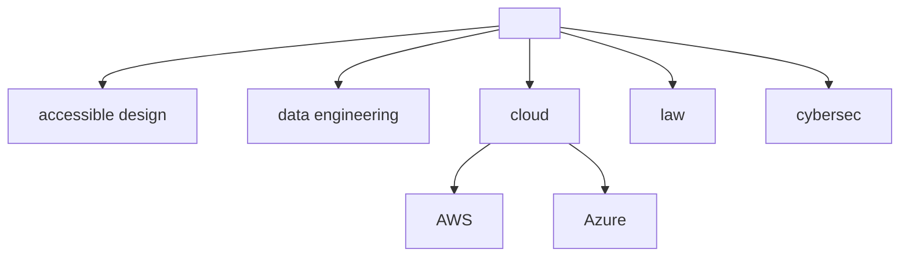

### Hey friends!

### Blog posts
<!-- BLOG-POST-LIST:START -->
- [Engineering challenges I faced when developing an AI-powered solution on niche social media](https://tomaszhamerla.com/blog/making-of-cloud-pirate/)
- [PowerPlatform for Azure Specialists](https://tomaszhamerla.com/blog/power-platform-for-azure-specialists/)
- [5 actionable takeaways from organizng mock interviews](https://tomaszhamerla.com/blog/mock-interviews-takeaways/)
- [Accessible security practices](https://tomaszhamerla.com/blog/accessible-security-practices/)
- [5 takeaways from Google technical wrtiting events](https://tomaszhamerla.com/blog/google-technical-writing/)
<!-- BLOG-POST-LIST:END -->
