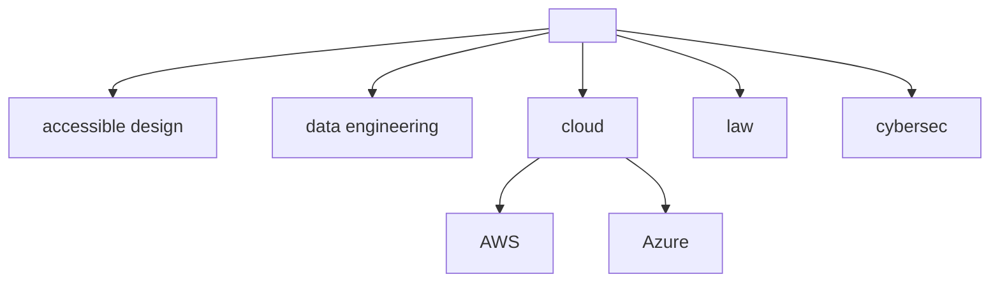

### Hey friends!

### Blog posts
<!-- BLOG-POST-LIST:START -->
- [5 actionable takeaways from organizng mock interviews](https://tomaszhamerla.com/blog/mock-interviews-takeaways/)
- [Accessible security practices](https://tomaszhamerla.com/blog/accessible-security-practices/)
- [5 takeaways from Google technical wrtiting events](https://tomaszhamerla.com/blog/google-technical-writing/)
- [How to ace Azure az305 exam](https://tomaszhamerla.com/blog/az305-prep/)
- [5 Mastodon gotchas to watch out for](https://tomaszhamerla.com/blog/mastodon-gotchas/)
<!-- BLOG-POST-LIST:END -->
